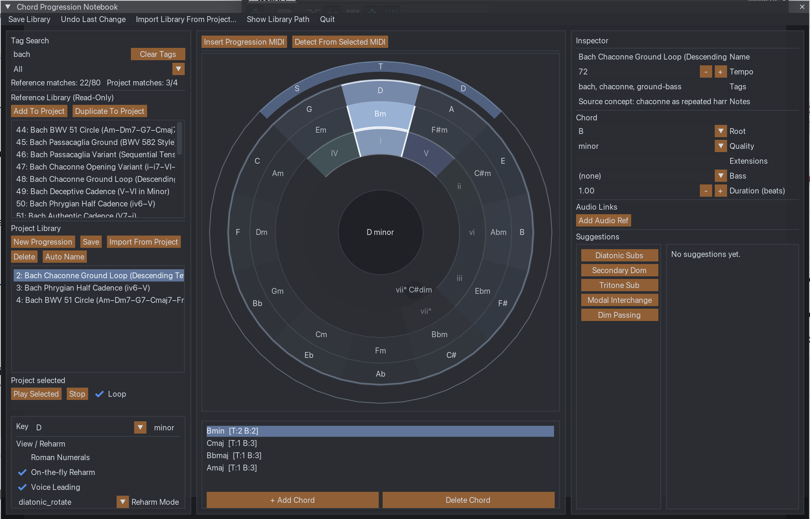
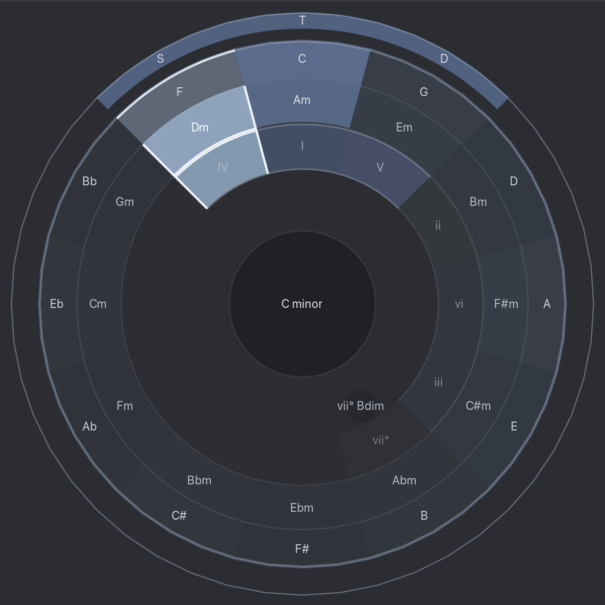
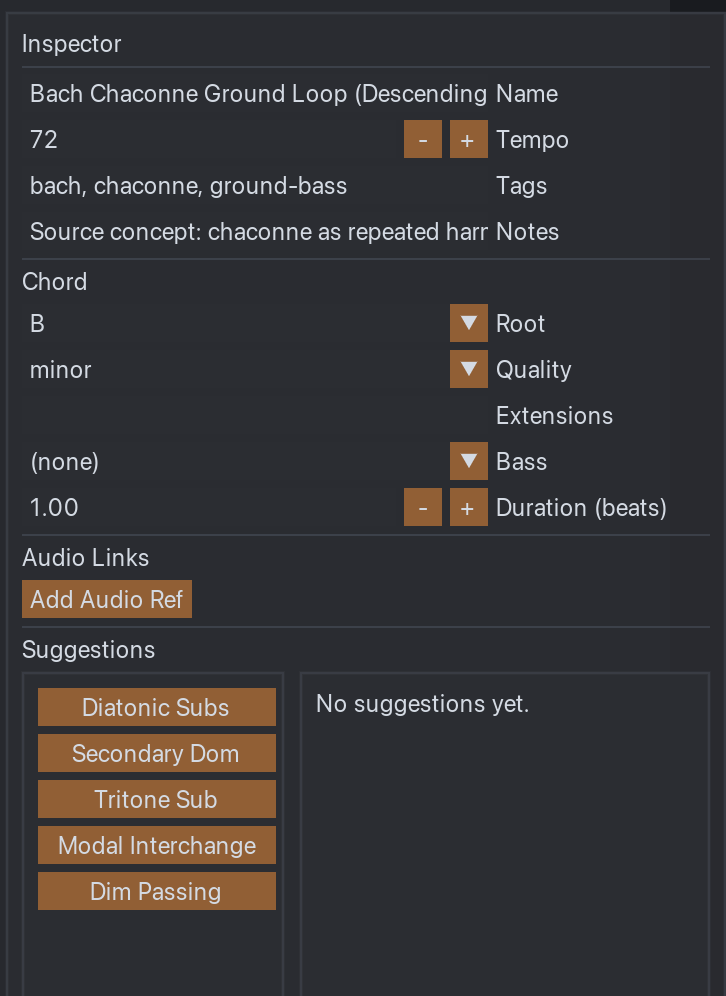

# Chord Progression Notebook

A REAPER-native chord progression notebook built with ReaScript (Lua) and ReaImGui.

Designed for storing, editing, visualising, and inserting chord progressions directly inside REAPER.

---

## Screenshots

### Main Interface

The main interface consists of:

- **Library panel** (left) – progression management and key selection  
- **Progression lane** (centre) – chord blocks, reharmonisation, MIDI insertion  
- **Inspector panel** (right) – detailed chord and progression editing  

---

### Circle of Fifths with Functional Harmony

- Key-aware Circle of Fifths  
- Relative minor ring  
- Optional Roman numeral display  
- Functional harmony overlay (T–S–D)  
- Diatonic highlighting  

---

### Chord Inspector & Editing

- Edit root, quality, extensions, bass  
- Adjustable duration  
- Progression tagging and notes  
- Insert single chords or full progressions as MIDI  

---

## Requirements

- REAPER (with Lua ReaScript enabled)
- ReaImGui (install via ReaPack)

If ReaImGui is not installed, the script displays a clear message and exits safely.

---

## Installation (via ReaPack – Recommended)

1. Install from the ReaTeam repository using ReaPack.
2. Open **Actions → Show action list**.
3. Run:  
   `Chord Progression Notebook`

The script is single-instance guarded.

---

## Features

- Project-local progression library
- Chord editing via inspector panel
- Circle of Fifths with functional harmony (T–S–D)
- Optional Roman numeral display
- Rule-based reharmonisation suggestions
- MIDI insertion (single chord or full progression)
- Chord detection from selected MIDI items
- Drag & drop reordering
- Project-safe persistence

---

## Data Storage

**Project-local library**