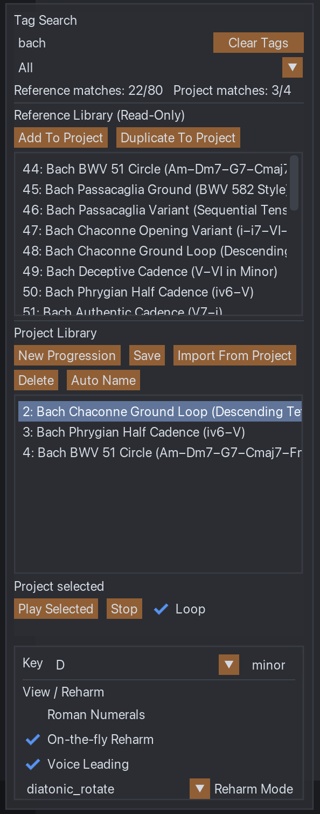

# Chord Progression Notebook

A REAPER-native chord progression notebook built with ReaScript (Lua) and ReaImGui.

Designed for storing, editing, visualising, and inserting chord progressions directly inside REAPER.

---

## Screenshots

### Main Interface

  

The main interface consists of:

- **Library panel** (left) – progression management and key selection  
- **Progression lane** (centre) – chord blocks, reharmonisation, MIDI insertion  
- **Inspector panel** (right) – detailed chord and progression editing  

---

### Circle of Fifths with Functional Harmony

  

- Key-aware Circle of Fifths  
- Relative minor ring  
- Optional Roman numeral display  
- Functional harmony overlay (T–S–D)  
- Diatonic highlighting  

---

### Chord Inspector & Editing

  

- Edit root, quality, extensions, bass  
- Adjustable duration  
- Progression tagging and notes  
- Insert single chords or full progressions as MIDI  

---

### Progressions Library

  

The Progressions Library is split into two coordinated areas:

- **Reference Library (Read-Only)**  
  Curated immutable progression source (seeded from `data/library.json`).
- **Project Library (Editable)**  
  Local, project-specific working set for arranging and reharmonization.

Key operations:

- `Add To Project` (always creates a new project copy)
- `Import From Project` (merge mode)
- `Restore From Reference` (right-click project row)
- Tag search + provenance filter
- Playback controls for selected progression (`Play Selected`, `Stop`, `Loop`)

Image note:
- Place your screenshot at `images/library.png` to populate this section.

---

## Current Status

This project is currently hosted in a personal repository.

The long-term goal is submission to the official ReaTeam ReaPack repository (after review).

The repository layout follows ReaTeam/ReaPack conventions:

- packaged under `Scripts/Nox-Modus/Chord Progression Notebook/`
- entry script includes ReaPack metadata tags (`@description`, `@version`, `@provides`)

---

## Requirements

- REAPER (with Lua ReaScript enabled)
- ReaImGui (install via ReaPack)

If ReaImGui is not installed, the script displays a clear message and exits safely.

---

## Installation (Manual – Development Phase)

1. Download or clone this repository.
2. Place the folder anywhere accessible by REAPER.
3. In REAPER, open:
   `Actions → Show action list`
4. Click:
   `ReaScript: Load...`
5. Select:
   `Scripts/Nox-Modus/Chord Progression Notebook/chord_notebook.lua`
6. Run:
   `Chord Progression Notebook`

The script is single-instance guarded.

## Installation (ReaPack Repository URL)

You can import this repository directly in ReaPack using:

`https://raw.githubusercontent.com/nox-modus/nox-chords-notebook/main/index.xml`

In REAPER:
1. `Extensions -> ReaPack -> Import repositories...`
2. Paste the URL above.
3. Browse/sync packages and install `Nox-Modus/Chord Progression Notebook`.

---

## Features

- Project-local progression library
- Chord editing via inspector panel
- Circle of Fifths with functional harmony (T–S–D)
- Optional Roman numeral display
- Rule-based reharmonisation suggestions
- MIDI insertion (single chord or full progression)
- Chord detection from selected MIDI items
- Drag & drop reordering
- Project-safe persistence

---

## Data Storage

The script follows REAPER conventions:

**Project-local library**

- Saved projects: `<project_dir>/.chord_notebook/library.json`
- Unsaved projects: `<REAPER resource path>/ChordNotebook/unsaved/library.json`

**UI Preferences (ExtState)**

- Section: `ChordNotebook`
- Key: `ui_prefs`

If the library file does not exist or is invalid, a seeded library is loaded from `data/library.json`.

---

## ReaTeam / ReaPack Conformance Notes

ReaTeam ReaPack indexing does not package scripts that live at repository root. For a ReaTeam PR, this repository must be structured so the entry script is inside a subdirectory, for example:

- `Scripts/Nox-Modus/Chord Progression Notebook/chord_notebook.lua`
- `Scripts/Nox-Modus/Chord Progression Notebook/lib/...`
- `Scripts/Nox-Modus/Chord Progression Notebook/data/library.json`

This repository is already organized in that shape for ReaTeam submission.

The script header in `chord_notebook.lua` already includes ReaPack metadata tags (`@description`, `@version`, `@author`, `@about`, `@provides`). When restructuring the folder for ReaTeam, review the `@provides` paths so they match the final layout.

Single-instance guard:

- The script uses ExtState section `ChordNotebook` and key `instance_lock`. Starting the script twice shows an "already running" message.

No third-party binaries:

- All functionality is implemented in ReaScript Lua + ReaImGui.

---

## Testing (Long-Term Support)

This repository includes a local test routine for regression checks and support triage:

- Run: `./tools/run_tests.sh`
- Outputs:
  - `tests/logs/syntax_YYYYMMDD_HHMMSS.log` (syntax checks)
  - `tests/logs/run_YYYYMMDD_HHMMSS.log` (run transcript)
  - `tests/logs/test_YYYYMMDD_HHMMSS.log` (test case log)

Coverage includes:

- Harmony model: `lib/chord_model.lua`
- Suggestion engine: `lib/harmony_engine.lua`
- JSON codec: `lib/json.lua`
- Roman numeral regression checks for common minor/aeolian sequences

Note: these tests run in a plain Lua interpreter and do not require REAPER.

---

## Troubleshooting

- **No window appears**
  - Ensure ReaImGui is installed via ReaPack and REAPER restarted.
  - Check REAPER console for an error message from the script.
- **Script reports "already running"**
  - Close the existing instance, or restart REAPER if a crash left the lock set.
- **Library not saving**
  - Ensure the current project directory is writable (saved projects), or that the REAPER resource path is writable (unsaved projects).

---

## Submission Checklist (ReaTeam)

- Entry script is in a subdirectory under `Scripts/` (not repository root).
- `@version` and changelog are updated before release.
- ReaImGui dependency is gracefully handled (message + early return).
- Any timeline edits are wrapped in undo blocks (MIDI insert paths).
- No OS junk files are committed (remove `.DS_Store`).
- No transient logs are committed (avoid committing `tests/logs/*`).

## Acknowledgements
Thanks to ChatGPT (OpenAI) for support in discussion, debugging, and iterative refinement during development.

## Support
This script is free and open-source (MIT License). See `LICENSE`.

For bugs and feature requests, please use this repository's issue tracker (recommended), and include:

- REAPER version + OS
- ReaImGui version
- a minimal reproduction (project state + steps)
- any console output

For optional ways to support development, see `SUPPORT.md`.

---

## Version Change Summary

### v0.9.3
- Hotfix: corrected ImGui guard lifecycle for collapsed/minimized windows.
- `End()` / `EndChild()` are now skipped when `Begin()` / `BeginChild()` return `false`.
- Resolves reported runtime errors: `ImGui_End: Calling End() too many times!` and follow-up `ImGui_PopStyleColor` invalid context messages.
- Added regression coverage for the minimize/collapse code path.

### v0.9.2
- Hotfix: fixed ReaPack package manifest to include `lib/ui/imgui_guard.lua`.
- Resolves post-upgrade startup error `module 'lib.ui.imgui_guard' not found` seen in `v0.9.1`.

### v0.9.1
- Hotfix: hardened ReaImGui `Begin*`/`End*` symmetry with guarded wrappers to prevent `ImGui_End: Calling End() too many times!` crashes.
- Added one-time per-callsite Begin-failure diagnostics and guard counters for runtime debugging.
- Added regression tests for guard behavior and static audit to prevent raw `ImGui_End*` lifecycle calls in UI modules.

### v0.9.0
- Added full undo workflow for project edits (`Undo Last Change` in menu).
- Added safety hardening for malformed library/progression/chord data.
- Added atomic library save with backup fallback load (`library.json.bak`).
- Refactored undo calls into shared helper module for consistency.
- Extended automated tests for safety normalization and undo behavior.

### v0.7.x to v0.8.x
- Added reference (read-only) + project (editable) split library workflow.
- Added `Add To Project` and `Restore From Reference`.
- Added `Import Library From Project` merge workflow (no destructive overwrite).
- Added tag filtering and provenance filtering for library browsing.
- Added path visibility helper (`Show Library Path`) to reduce storage confusion.
- Added progression playback controls (`Play Selected`, `Stop`, `Loop`).
- Added on-the-fly reharmonization on key/mode change.
- Added optional voice-leading behavior for playback/insertion.
- Multiple GUI layout and stability fixes for list panels and controls.
